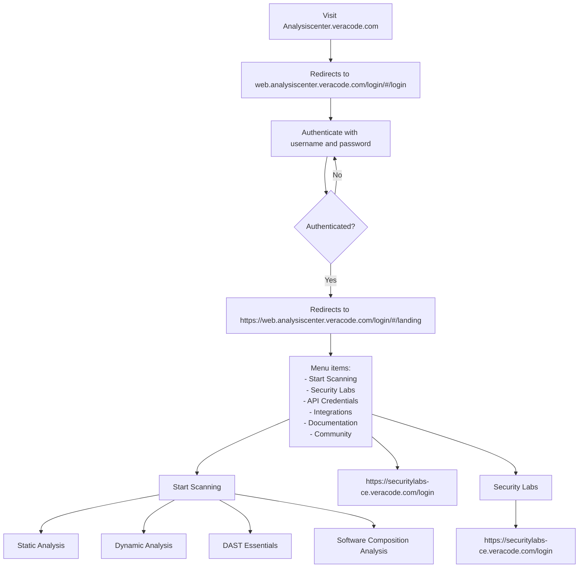

```mermaid 
graph TD;
    A[Visit Analysiscenter.veracode.com] --> B[Redirects to web.analysiscenter.veracode.com/login/#/login];
    B --> C[Authenticate with username and password];
    C --> D{Authenticated?};
    D -->|Yes| E[Redirects to https://web.analysiscenter.veracode.com/login/#/landing];
    D -->|No| C;
    E --> F[Menu items: <br> - Start Scanning <br> - Security Labs <br> - API Credentials <br> - Integrations <br> - Documentation <br> - Community];
    F --> G[Start Scanning];
    G --> H[Static Analysis];
    G --> I[Dynamic Analysis];
    G --> J[DAST Essentials];
    G --> K[Software Composition Analysis];
    F --> L[https://securitylabs-ce.veracode.com/login];
    F --> M[Security Labs];
    M --> N[https://securitylabs-ce.veracode.com/login];
```
